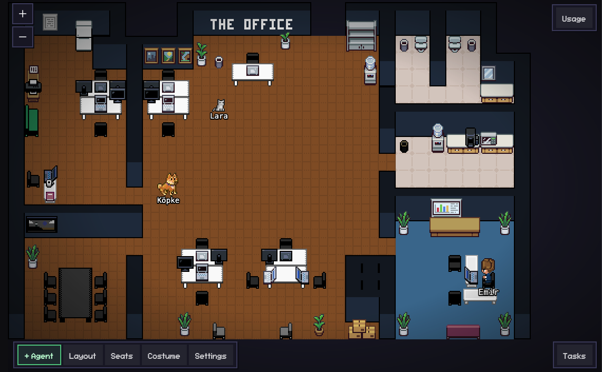

# Pixel Agents

A VS Code extension that turns your AI coding agents into animated pixel art characters in a virtual office.

Each Claude Code terminal you open spawns a character that walks around, sits at desks, and visually reflects what the agent is doing — typing when writing code, reading when searching files, waiting when it needs your attention.

Based on the original [Pixel Agents extension](https://marketplace.visualstudio.com/items?itemName=pablodelucca.pixel-agents) by pablodelucca. This fork is developed by **Emir Yorgun** ([@hootbu](https://github.com/hootbu)) with the following additions:

- Seat management and desk assignment system
- Task panel with real-time agent activity tracking
- Sub-agent visualization — Task tool spawns as separate characters linked to their parent
- Adaptive status detection with "Thinking..." indicator and smarter permission timers
- Zoom persistence and pixel-perfect 1px zoom steps
- Panel state retention across tab switches
- Sound notifications on agent turn completion
- Pixel text — place custom text on walls with a built-in font renderer and z-layer control



## Features

- **One agent, one character** — every Claude Code terminal gets its own animated character
- **Live activity tracking** — characters animate based on what the agent is actually doing (writing, reading, running commands)
- **Seat management** — assign agents to specific desks, reassign with click-to-select UI, seats auto-generated from chair furniture
- **Task panel & sub-agents** — real-time panel showing agent activities; Task tool sub-agents spawn as separate characters linked to their parent
- **Office layout editor** — design your office with floors, walls, and furniture using a built-in editor
- **Speech bubbles** — visual indicators when an agent is waiting for input or needs permission
- **Sound notifications** — optional chime when an agent finishes its turn
- **Persistent layouts** — your office design is saved and shared across VS Code windows
- **Zoom persistence** — your chosen zoom level is remembered across sessions and window reloads
- **Panel state retention** — switching to another panel (e.g. Debug) and back preserves all state — no more layout resets
- **Pixel-perfect zoom** — zoom in 1px increments with the level displayed in pixels (e.g. 16px)
- **Pixel text** — place custom pixel art text on walls with configurable font size, scale, and color; z-layer button to render text in front of walls but behind characters
- **Diverse characters** — 6 diverse characters with hue-shifted variants

<p align="center">
  
</p>

## Seats

Seats are auto-generated from chair furniture placed in the layout editor. Each chair footprint tile becomes a seat; multi-tile chairs (like couches) produce multiple seats.

- **Auto-assignment** — when an agent spawns, it claims the first available seat
- **Seat Mode** — toggle Seat Mode from the toolbar, click an agent to select it (white outline), then click an available seat to reassign
- **Visual indicators** — blue = your seat, green = available, red = occupied by another agent
- **Smart facing** — characters face the adjacent desk automatically based on furniture orientation
- **Persistence** — seat assignments are saved per workspace and restored across sessions

When idle, agents stay seated for 2-4 minutes before wandering around the office, then return to their assigned seat.

## Task Panel & Sub-Agents

The Task panel (toggle via the button in the bottom-right toolbar) shows all active agents and their current activities in real time.

- **Live status** — each agent displays its current tool activity (Reading, Writing, Running command, Idle)
- **Sub-agent spawning** — when Claude Code's Task tool creates a sub-agent, a new character spawns near the parent with a matrix-style animation
- **Nested display** — sub-agents appear indented below their parent in the Task panel
- **Permission bubbles** — amber dots and speech bubbles appear when a sub-agent needs user approval
- **Auto-cleanup** — sub-agents despawn automatically when their task completes
- **Click to focus** — click any agent in the Task panel to jump to its terminal

Sub-agents inherit their parent's character palette and are placed at the closest free seat.

## Requirements

- VS Code 1.109.0 or later
- [Claude Code CLI](https://docs.anthropic.com/en/docs/claude-code) installed and configured

## Getting Started

### Install from release

1. Go to the [Releases](https://github.com/hootbu/pixel-agents/releases) page
2. Download the latest `.vsix` file
3. Install via terminal:
   ```bash
   code --install-extension pixel-agent-1.1.0.vsix
   ```
   Or in VS Code: **Cmd+Shift+P → Install from VSIX** and select the downloaded file.
4. Reload VS Code (**Cmd+Shift+P → Reload Window**)

### Install from source

```bash
git clone https://github.com/hootbu/pixel-agents.git
cd pixel-agents
npm install
cd webview-ui && npm install && cd ..
npm run build
```

Then press **F5** in VS Code to launch the Extension Development Host.

### Build & install via .vsix

To build, package, and install as a `.vsix` extension in one step, add this alias to your `~/.zshrc`:

```bash
alias pxbuild="cd ~/pixel-agents && npm run build && npx vsce package --no-dependencies && code --install-extension pixel-agents-1.0.0.vsix --force"
```

Then run `pxbuild` from any terminal. After installation, reload VS Code (**Cmd+Shift+P → Reload Window**).

### Usage

1. Open the **Pixel Agents** panel (it appears in the bottom panel area alongside your terminal)
2. Click **+ Agent** to spawn a new Claude Code terminal and its character
3. Start coding with Claude — watch the character react in real time
4. Click a character to select it, then click a seat to reassign it
5. Open the **Task panel** to monitor agent activities and sub-agent spawning
6. Click **Layout** to open the office editor and customize your space

## Layout Editor

The built-in editor lets you design your office:

- **Floor** — Full HSB color control
- **Walls** — Auto-tiling walls with color customization
- **Pixel text** — place text on walls with two font sizes (3x5, 5x7), adjustable pixel scale (1-3x), and hex color picker; edit button to modify text after placement
- **Z-layer control** — bring furniture in front of walls while keeping it behind walking characters; toggle with the layer button on selected items
- **Tools** — Select, paint, erase, place, eyedropper, pick
- **Undo/Redo** — 50 levels with Ctrl+Z / Ctrl+Y
- **Export/Import** — Share layouts as JSON files via the Settings modal

The grid is expandable up to 64×64 tiles. Click the ghost border outside the current grid to grow it.

### Office Assets

The office tileset used in this project and available via the extension is **[Office Interior Tileset (16x16)](https://donarg.itch.io/officetileset)** by **Donarg**, available on itch.io for **$2 USD**.

This is the only part of the project that is not freely available. The tileset is not included in this repository due to its license. To use Pixel Agents locally with the full set of office furniture and decorations, purchase the tileset and run the asset import pipeline:

```bash
npm run import-tileset
```

Fair warning: the import pipeline is not exactly straightforward — the out-of-the-box tileset assets aren't the easiest to work with, and while I've done my best to make the process as smooth as possible, it may require some manual tweaking. If you have experience creating pixel art office assets and would like to contribute freely usable tilesets for the community, that would be hugely appreciated.

The extension will still work without the tileset — you'll get the default characters and basic layout, but the full furniture catalog requires the imported assets.

## How It Works

Pixel Agents watches Claude Code's JSONL transcript files to track what each agent is doing. When an agent uses a tool (like writing a file or running a command), the extension detects it and updates the character's animation accordingly. No modifications to Claude Code are needed — it's purely observational.

The webview runs a lightweight game loop with canvas rendering, BFS pathfinding, and a character state machine (idle → walk → type/read). Everything is pixel-perfect with 1px zoom increments, and your zoom preference persists across sessions via VS Code's global state.

## Tech Stack

- **Extension**: TypeScript, VS Code Webview API, esbuild
- **Webview**: React 19, TypeScript, Vite, Canvas 2D

## Known Limitations

- **Agent-terminal sync** — the way agents are connected to Claude Code terminal instances is not super robust and sometimes desyncs, especially when terminals are rapidly opened/closed or restored across sessions.
- **Heuristic-based status detection** — Claude Code's JSONL transcript format does not provide perfectly clear signals for all state transitions. While the detection has been significantly improved with adaptive timeouts, early completion signals, and smarter idle detection, edge cases remain — particularly around text-only turns and rapid tool sequences.
- **Windows/macOS testing** — the extension has been tested on Windows 11 and macOS. It may work on Linux, but there could be unexpected issues with file watching, paths, or terminal behavior.

## Roadmap

Implemented in this fork:

- ~~**Desks as directories / seat assignment**~~ — agents can be assigned to specific desks via Seat Mode
- ~~**Sub-agent visualization**~~ — Task tool sub-agents spawn as separate characters with real-time tracking
- ~~**Panel state retention**~~ — webview context is retained when hidden, no more state loss on panel switch
- ~~**Zoom persistence & pixel-perfect steps**~~ — zoom level saved across sessions, 1px increments, px display
- ~~**Better status detection**~~ — smarter agent state transitions with adaptive permission timers, early completion signals, and a new "Thinking..." indicator (see below)
- ~~**Pixel text & z-layer**~~ — custom pixel art text on walls with font/scale/color options; z-layer toggle to control draw order relative to walls and characters

### Better Status Detection

The original heuristic-based status detection used a fixed 7-second timeout to guess whether an agent was stuck waiting for user permission. This caused frequent false positives — slow tools like Bash commands or MCP integrations would trigger a "Needs approval" bubble even though the tool was still running normally.

Key improvements:

- **Adaptive permission timeouts** — timeout scales by tool type (5s for fast tools, 15s for network, 20s for Bash) instead of a fixed 7s for everything
- **Early completion signals** — listens to `mcp_progress` and `hook_progress` events to detect tool completion early, eliminating false permission bubbles
- **"Thinking..." indicator** — Task panel shows "Thinking..." with a blue pulsing dot when Claude is processing, instead of misleading "Idle"
- **Smarter idle detection** — waiting timer no longer gets reset by metadata records, and a fallback timer catches turns where `turn_duration` is not emitted

Still open for contributions:

- **Improve agent-terminal reliability** — more robust connection and sync between characters and Claude Code instances
- **Community assets** — freely usable pixel art tilesets or characters that anyone can use without purchasing third-party assets
- **Agent creation and definition** — define agents with custom skills, system prompts, names, and skins before launching them
- **Claude Code agent teams** — native support for [agent teams](https://code.claude.com/docs/en/agent-teams), visualizing multi-agent coordination and communication
- **Git worktree support** — agents working in different worktrees to avoid conflict from parallel work on the same files
- **Support for other agentic frameworks** — [OpenCode](https://github.com/nichochar/opencode), or really any kind of agentic experiment you'd want to run inside a pixel art interface (see [simile.ai](https://simile.ai/) for inspiration)

If any of these interest you, feel free to open an issue or submit a PR.

## Contributions

See [CONTRIBUTORS.md](CONTRIBUTORS.md) for instructions on how to contribute to this project.

Please read our [Code of Conduct](CODE_OF_CONDUCT.md) before participating.

## Maintainer

This fork is maintained by **Emir Yorgun** ([@hootbu](https://github.com/hootbu)). All additions listed above were built on top of the original project by [pablodelucca](https://github.com/pablodelucca).

## Supporting the Original Project

If you find Pixel Agents useful, consider supporting the original author:

<a href="https://github.com/sponsors/pablodelucca">
  
</a>
<a href="https://ko-fi.com/pablodelucca">
  
</a>

## License

This project is licensed under the [MIT License](LICENSE).

---

# Pixel Agents (TR)

AI kodlama ajanlarınızı sanal bir ofiste animasyonlu piksel sanat karakterlerine dönüştüren bir VS Code eklentisi.

Açtığınız her Claude Code terminali, ofiste dolaşan, masalarda oturan ve ajanın ne yaptığını görsel olarak yansıtan bir karakter oluşturur — kod yazarken yazıyor, dosya ararken okuyor, sizin müdahalenizi beklerken bekliyor.

pablodelucca tarafından geliştirilen orijinal [Pixel Agents eklentisine](https://marketplace.visualstudio.com/items?itemName=pablodelucca.pixel-agents) dayanmaktadır. Bu fork **Emir Yorgun** ([@hootbu](https://github.com/hootbu)) tarafından aşağıdaki eklemelerle geliştirilmiştir:

- Oturma yeri yönetimi ve masa atama sistemi
- Gerçek zamanlı ajan aktivite takibi ile görev paneli
- Alt-ajan görselleştirmesi — Task aracı, ana ajana bağlı ayrı karakterler olarak ortaya çıkar
- "Düşünüyor..." göstergesi ve daha akıllı izin zamanlayıcıları ile uyarlanabilir durum algılama
- Yakınlaştırma kalıcılığı ve piksel-mükemmel 1px yakınlaştırma adımları
- Panel geçişlerinde durum koruma
- Ajan turu tamamlandığında ses bildirimleri
- Piksel yazı — yerleşik font oluşturucu ve z-katman kontrolü ile duvarlara özel yazı yerleştirme


## Özellikler

- **Bir ajan, bir karakter** — her Claude Code terminali kendi animasyonlu karakterine sahip olur
- **Canlı aktivite takibi** — karakterler, ajanın gerçekte ne yaptığına göre animasyon yapar (yazma, okuma, komut çalıştırma)
- **Oturma yeri yönetimi** — ajanları belirli masalara atayın, tıkla-seç arayüzüyle yeniden atayın, sandalye mobilyalarından otomatik oluşturulan koltuklar
- **Görev paneli ve alt-ajanlar** — ajan aktivitelerini gösteren gerçek zamanlı panel; Task aracı alt-ajanları, ana ajana bağlı ayrı karakterler olarak ortaya çıkar
- **Ofis düzeni editörü** — yerleşik editör ile zemin, duvar ve mobilyalarla ofisinizi tasarlayın
- **Konuşma balonları** — ajan girdi beklerken veya izin gerektiğinde görsel göstergeler
- **Ses bildirimleri** — ajan turunu bitirdiğinde isteğe bağlı bildirim sesi
- **Kalıcı düzenler** — ofis tasarımınız kaydedilir ve VS Code pencereleri arasında paylaşılır
- **Yakınlaştırma kalıcılığı** — seçtiğiniz yakınlaştırma seviyesi oturumlar ve pencere yeniden yüklemeleri arasında hatırlanır
- **Panel durumu koruma** — başka bir panele (ör. Debug) geçip geri dönmek tüm durumu korur — artık düzen sıfırlanması yok
- **Piksel-mükemmel yakınlaştırma** — 1px artışlarla yakınlaştırma, seviye piksel olarak görüntülenir (ör. 16px)
- **Piksel yazı** — duvarlara ayarlanabilir font boyutu, ölçek ve renk ile özel piksel sanat yazısı yerleştirin; z-katman butonu ile yazıyı duvarların önünde ama karakterlerin arkasında gösterin
- **Çeşitli karakterler** — renk kaydırmalı varyantlarla 6 farklı karakter

<p align="center">
  
</p>

## Oturma Yerleri

Oturma yerleri, düzen editöründe yerleştirilen sandalye mobilyalarından otomatik olarak oluşturulur. Her sandalye ayak izi karesi bir koltuk olur; çok kareli sandalyeler (koltuklar gibi) birden fazla oturma yeri üretir.

- **Otomatik atama** — bir ajan oluştuğunda, ilk müsait koltuğu alır
- **Koltuk Modu** — araç çubuğundan Koltuk Modunu açın, seçmek için bir ajana tıklayın (beyaz çerçeve), ardından yeniden atamak için müsait bir koltuğa tıklayın
- **Görsel göstergeler** — mavi = sizin koltuğunuz, yeşil = müsait, kırmızı = başka bir ajan tarafından dolu
- **Akıllı yön** — karakterler mobilya yönüne göre otomatik olarak bitişik masaya bakar
- **Kalıcılık** — koltuk atamaları çalışma alanı başına kaydedilir ve oturumlar arasında geri yüklenir

Boştayken, ajanlar 2-4 dakika oturur, ardından ofiste dolaşır ve atanmış koltuklarına geri döner.

## Görev Paneli ve Alt-Ajanlar

Görev paneli (sağ alt araç çubuğundaki düğme ile açılır) tüm aktif ajanları ve mevcut aktivitelerini gerçek zamanlı olarak gösterir.

- **Canlı durum** — her ajan mevcut araç aktivitesini gösterir (Okuma, Yazma, Komut çalıştırma, Boşta)
- **Alt-ajan oluşturma** — Claude Code'un Task aracı bir alt-ajan oluşturduğunda, ana ajanın yakınında matrix tarzı animasyonla yeni bir karakter belirir
- **İç içe görüntüleme** — alt-ajanlar, Görev panelinde ana ajanlarının altında girintili olarak görünür
- **İzin balonları** — alt-ajan kullanıcı onayına ihtiyaç duyduğunda kehribar noktalar ve konuşma balonları belirir
- **Otomatik temizlik** — alt-ajanlar görevleri tamamlandığında otomatik olarak kaybolur
- **Odaklanmak için tıkla** — Görev panelinde herhangi bir ajana tıklayarak terminaline atlayın

Alt-ajanlar, ana ajanın karakter paletini miras alır ve en yakın boş koltuğa yerleştirilir.

## Gereksinimler

- VS Code 1.109.0 veya üstü
- [Claude Code CLI](https://docs.anthropic.com/en/docs/claude-code) kurulu ve yapılandırılmış

## Başlarken

### Release'den kurulum

1. [Releases](https://github.com/hootbu/pixel-agents/releases) sayfasına gidin
2. En son `.vsix` dosyasını indirin
3. Terminal ile kurun:
   ```bash
   code --install-extension pixel-agent-1.1.0.vsix
   ```
   Veya VS Code'da: **Cmd+Shift+P → Install from VSIX** ile indirilen dosyayı seçin.
4. VS Code'u yeniden yükleyin (**Cmd+Shift+P → Reload Window**)

### Kaynaktan kurulum

```bash
git clone https://github.com/hootbu/pixel-agents.git
cd pixel-agents
npm install
cd webview-ui && npm install && cd ..
npm run build
```

Ardından VS Code'da **F5**'e basarak Extension Development Host'u başlatın.

### .vsix ile derleme ve kurulum

`.vsix` eklentisini tek adımda derleyip kurmak için `~/.zshrc` dosyanıza şu alias'ı ekleyin:

```bash
alias pxbuild="cd ~/pixel-agents && npm run build && npx vsce package --no-dependencies && code --install-extension pixel-agents-1.0.0.vsix --force"
```

Ardından herhangi bir terminalden `pxbuild` çalıştırın. Kurulumdan sonra VS Code'u yeniden yükleyin (**Cmd+Shift+P → Reload Window**).

### Kullanım

1. **Pixel Agents** panelini açın (terminalinizin yanında alt panel alanında görünür)
2. Yeni bir Claude Code terminali ve karakteri oluşturmak için **+ Agent**'a tıklayın
3. Claude ile kodlamaya başlayın — karakterin gerçek zamanlı tepki vermesini izleyin
4. Seçmek için bir karaktere tıklayın, ardından yeniden atamak için bir koltuğa tıklayın
5. Ajan aktivitelerini ve alt-ajan oluşturmayı izlemek için **Görev panelini** açın
6. Ofis editörünü açıp alanınızı özelleştirmek için **Layout**'a tıklayın

## Düzen Editörü

Yerleşik editör ofisinizi tasarlamanıza olanak tanır:

- **Zemin** — Tam HSB renk kontrolü
- **Duvarlar** — Renk özelleştirmeli otomatik döşenen duvarlar
- **Piksel yazı** — iki font boyutu (3x5, 5x7), ayarlanabilir piksel ölçeği (1-3x) ve hex renk seçici ile duvarlara yazı yerleştirin; yerleştirme sonrası düzenleme butonu
- **Z-katman kontrolü** — mobilyayı yürüyen karakterlerin arkasında tutarak duvarların önüne çıkarın; seçili öğelerdeki katman butonu ile değiştirin
- **Araçlar** — Seçme, boyama, silme, yerleştirme, damlalık, seçici
- **Geri Al/Yinele** — Ctrl+Z / Ctrl+Y ile 50 seviye
- **Dışa/İçe Aktarma** — Ayarlar penceresi üzerinden JSON dosyaları olarak düzen paylaşımı

Izgara 64×64 kareye kadar genişletilebilir. Mevcut ızgaranın dışındaki hayalet kenarlığa tıklayarak büyütün.

### Ofis Varlıkları

Bu projede kullanılan ofis tileset'i **[Office Interior Tileset (16x16)](https://donarg.itch.io/officetileset)** olup **Donarg** tarafından itch.io'da **2 USD** karşılığında sunulmaktadır.

Bu, projenin özgürce kullanılamayan tek parçasıdır. Tileset, lisansı nedeniyle bu depoya dahil edilmemiştir. Pixel Agents'ı tam ofis mobilyaları ve dekorasyonları ile yerel olarak kullanmak için tileset'i satın alın ve varlık içe aktarma hattını çalıştırın:

```bash
npm run import-tileset
```

Uyarı: içe aktarma hattı tam olarak basit değildir — hazır tileset varlıkları ile çalışmak en kolay değildir ve süreci olabildiğince sorunsuz hale getirmek için elimden geleni yaptım, ancak bazı manuel ayarlamalar gerekebilir. Piksel sanat ofis varlıkları oluşturma deneyiminiz varsa ve topluluk için ücretsiz kullanılabilir tileset'ler katkıda bulunmak isterseniz, bu çok takdir edilecektir.

Eklenti tileset olmadan da çalışacaktır — varsayılan karakterler ve temel düzeni elde edersiniz, ancak tam mobilya kataloğu içe aktarılan varlıkları gerektirir.

## Nasıl Çalışır

Pixel Agents, her ajanın ne yaptığını takip etmek için Claude Code'un JSONL transkript dosyalarını izler. Bir ajan bir araç kullandığında (dosya yazma veya komut çalıştırma gibi), eklenti bunu algılar ve karakterin animasyonunu buna göre günceller. Claude Code'da herhangi bir değişiklik gerekmez — tamamen gözlemseldir.

Webview, canvas rendering, BFS yol bulma ve bir karakter durum makinesi (boşta → yürüme → yazma/okuma) ile hafif bir oyun döngüsü çalıştırır. Her şey 1px yakınlaştırma artışlarıyla piksel-mükemmeldir ve yakınlaştırma tercihiniz VS Code'un global state'i aracılığıyla oturumlar arasında kalıcıdır.

## Teknoloji Yığını

- **Eklenti**: TypeScript, VS Code Webview API, esbuild
- **Webview**: React 19, TypeScript, Vite, Canvas 2D

## Bilinen Sınırlamalar

- **Ajan-terminal senkronizasyonu** — ajanların Claude Code terminal örneklerine bağlanma şekli çok sağlam değildir ve bazen senkronizasyon bozulur, özellikle terminaller hızlıca açılıp kapatıldığında veya oturumlar arasında geri yüklendiğinde.
- **Sezgisel tabanlı durum algılama** — Claude Code'un JSONL transkript formatı tüm durum geçişleri için mükemmel net sinyaller sağlamaz. Algılama, uyarlanabilir zaman aşımları, erken tamamlanma sinyalleri ve daha akıllı boşta algılama ile önemli ölçüde iyileştirilmiş olsa da, özellikle salt metin turları ve hızlı araç dizileri etrafında uç durumlar kalmaktadır.
- **Windows/macOS testi** — eklenti Windows 11 ve macOS'ta test edilmiştir. Linux'ta çalışabilir, ancak dosya izleme, yollar veya terminal davranışı ile ilgili beklenmeyen sorunlar olabilir.

## Yol Haritası

Bu fork'ta uygulanmış:

- ~~**Masalar dizin olarak / koltuk atama**~~ — ajanlar Koltuk Modu ile belirli masalara atanabilir
- ~~**Alt-ajan görselleştirmesi**~~ — Task aracı alt-ajanları, gerçek zamanlı takip ile ayrı karakterler olarak ortaya çıkar
- ~~**Panel durumu koruma**~~ — webview bağlamı gizlendiğinde korunur, panel geçişinde artık durum kaybı yok
- ~~**Yakınlaştırma kalıcılığı ve piksel-mükemmel adımlar**~~ — yakınlaştırma seviyesi oturumlar arasında kaydedilir, 1px artışlar, px gösterimi
- ~~**Daha iyi durum algılama**~~ — uyarlanabilir izin zamanlayıcıları, erken tamamlanma sinyalleri ve yeni "Düşünüyor..." göstergesi ile daha akıllı ajan durum geçişleri (aşağıya bakın)
- ~~**Piksel yazı ve z-katman**~~ — duvarlara font/ölçek/renk seçenekleriyle özel piksel sanat yazısı; duvarlar ve karakterlere göre çizim sırasını kontrol eden z-katman değiştirici

### Daha İyi Durum Algılama

Orijinal sezgisel tabanlı durum algılama, bir ajanın kullanıcı izni için takılıp kalmadığını tahmin etmek için sabit 7 saniyelik bir zaman aşımı kullanıyordu. Bu, sık sık yanlış pozitifler üretiyordu — Bash komutları veya MCP entegrasyonları gibi yavaş araçlar, araç hala normal şekilde çalışıyor olsa bile "Onay gerekiyor" balonu tetikliyordu.

Temel iyileştirmeler:

- **Uyarlanabilir izin zaman aşımları** — zaman aşımı, her şey için sabit 7s yerine araç türüne göre ölçeklenir (hızlı araçlar için 5s, ağ için 15s, Bash için 20s)
- **Erken tamamlanma sinyalleri** — araç tamamlanmasını erken algılamak için `mcp_progress` ve `hook_progress` olaylarını dinler, yanlış izin balonlarını ortadan kaldırır
- **"Düşünüyor..." göstergesi** — Görev paneli, yanıltıcı "Boşta" yerine Claude işlem yaparken mavi titreyen nokta ile "Düşünüyor..." gösterir
- **Daha akıllı boşta algılama** — bekleme zamanlayıcısı artık metadata kayıtları tarafından sıfırlanmaz ve `turn_duration` yayılmadığı turları yakalamak için bir yedek zamanlayıcı bulunur

Katkılara açık:

- **Ajan-terminal güvenilirliğini iyileştirme** — karakterler ve Claude Code örnekleri arasında daha sağlam bağlantı ve senkronizasyon
- **Topluluk varlıkları** — herkesin üçüncü taraf varlıklar satın almadan kullanabileceği ücretsiz piksel sanat tileset'leri veya karakterler
- **Ajan oluşturma ve tanımlama** — ajanları özel beceriler, sistem promptları, isimler ve görünümlerle başlatmadan önce tanımlama
- **Claude Code ajan takımları** — [ajan takımları](https://code.claude.com/docs/en/agent-teams) için yerel destek, çoklu ajan koordinasyonunu ve iletişimini görselleştirme
- **Git worktree desteği** — aynı dosyalar üzerinde paralel çalışmadan kaynaklanan çakışmayı önlemek için farklı worktree'lerde çalışan ajanlar
- **Diğer ajantik framework'ler için destek** — [OpenCode](https://github.com/nichochar/opencode) veya piksel sanat arayüzünde çalıştırmak isteyebileceğiniz herhangi bir ajantik deney (ilham için [simile.ai](https://simile.ai/)'ya bakın)

Bunlardan herhangi biri ilginizi çekiyorsa, bir issue açın veya PR gönderin.

## Katkıda Bulunma

Bu projeye nasıl katkıda bulunacağınız için [CONTRIBUTORS.md](CONTRIBUTORS.md) dosyasına bakın.

Katılmadan önce lütfen [Davranış Kurallarımızı](CODE_OF_CONDUCT.md) okuyun.

## Geliştirici

Bu fork **Emir Yorgun** ([@hootbu](https://github.com/hootbu)) tarafından sürdürülmektedir. Yukarıda listelenen tüm eklemeler, [pablodelucca](https://github.com/pablodelucca) tarafından geliştirilen orijinal proje üzerine inşa edilmiştir.

## Orijinal Projeyi Destekleme

Pixel Agents'ı faydalı buluyorsanız, orijinal yazarı desteklemeyi düşünün:

<a href="https://github.com/sponsors/pablodelucca">
  
</a>
<a href="https://ko-fi.com/pablodelucca">
  
</a>

## Lisans

Bu proje [MIT Lisansı](LICENSE) altında lisanslanmıştır.
