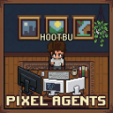
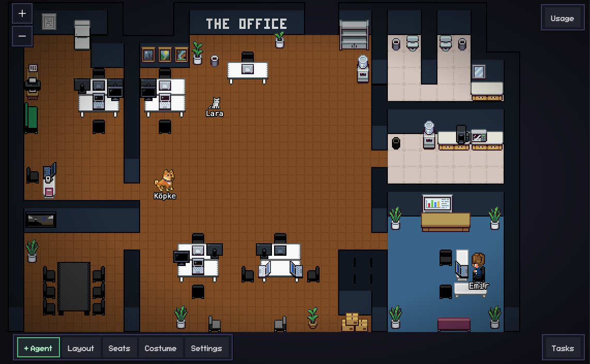
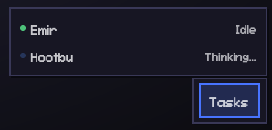
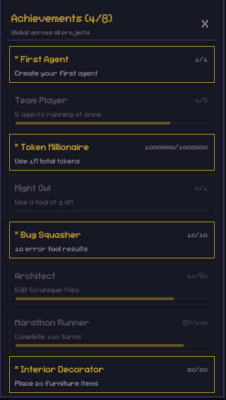
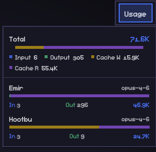
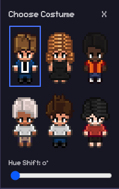

**English** | [Türkçe](README.tr.md)

<p align="center">
  
</p>

<p align="center">
  <a href="https://marketplace.visualstudio.com/items?itemName=hootbu.pixel-agent"></a>
  <a href="https://marketplace.visualstudio.com/items?itemName=hootbu.pixel-agent"></a>
  <a href="LICENSE"></a>
  <a href="https://github.com/hootbu/pixel-agents"></a>
</p>

# Pixel Agents

Tired of staring at spinning loaders while Claude Code works? Pixel Agents turns every Claude terminal into an animated character in a virtual office, so you can **see** what your AI is doing in real time.

Each Claude Code terminal you open spawns a character that walks around, sits at desks, and visually reflects what the agent is doing — typing when writing code, reading when searching files, waiting when it needs your attention.

<details>
<summary><strong>Table of Contents</strong></summary>

- [Features](#features)
- [Seats](#seats)
- [Task Panel & Sub-Agents](#task-panel--sub-agents)
- [Achievements](#achievements)
- [Office Pets](#office-pets)
- [Token Usage](#token-usage)
- [Costume Mode](#costume-mode)
- [Requirements](#requirements)
- [Getting Started](#getting-started)
- [Layout Editor](#layout-editor)
- [How It Works](#how-it-works)
- [Tech Stack](#tech-stack)
- [Roadmap](#roadmap)
- [Contributing](#contributing)
- [License](#license)

</details>

Based on the original [Pixel Agents extension](https://marketplace.visualstudio.com/items?itemName=pablodelucca.pixel-agents) by pablodelucca. This fork is developed by **Emir Yorgun** ([@hootbu](https://github.com/hootbu)) with the following additions:

**🎮 Visualization & Office Life**
- Sub-agent visualization — Task tool spawns as separate characters linked to their parent
- Office pets — cats and dogs with AI behaviors, configurable via Settings
- Mood reactions — happy, error, and stressed emoji bubbles based on agent activity

**📊 Insights & Tracking**
- Task panel with real-time agent activity tracking
- Real-time token usage panel with per-agent breakdown and color-coded progress bars
- Achievement system — 8 unlockable achievements with progress tracking and gallery

**🎨 Customization**
- Seat management and desk assignment system
- Pixel text — place custom text on walls with a built-in font renderer and z-layer control
- Costume mode — change agent appearance at runtime with 6 character models and hue shift slider

**🔧 Reliability & UX**
- Adaptive status detection with "Thinking..." indicator and smarter permission timers
- Zoom persistence and pixel-perfect 1px zoom steps
- Panel state retention across tab switches
- Sound notifications on agent turn completion



## Features

- **One agent, one character** — every Claude Code terminal gets its own animated character
- **Live activity tracking** — characters animate based on what the agent is actually doing (writing, reading, running commands)
- **Seat management** — assign agents to specific desks, reassign with click-to-select UI, seats auto-generated from chair furniture
- **Task panel & sub-agents** — real-time panel showing agent activities; Task tool sub-agents spawn as separate characters linked to their parent
- **Office layout editor** — design your office with floors, walls, and furniture using a built-in editor
- **Speech bubbles** — visual indicators when an agent is waiting for input or needs permission
- **Sound notifications** — optional chime when an agent finishes its turn
- **Persistent layouts** — your office design is saved and shared across VS Code windows
- **Zoom persistence** — your chosen zoom level is remembered across sessions and window reloads
- **Panel state retention** — switching to another panel (e.g. Debug) and back preserves all state — no more layout resets
- **Pixel-perfect zoom** — zoom in 1px increments with the level displayed in pixels (e.g. 16px)
- **Pixel text** — place custom pixel art text on walls with configurable font size, scale, and color; z-layer button to render text in front of walls but behind characters
- **Token usage panel** — real-time token tracking with per-agent breakdown, stacked color-coded progress bars (Input/Output/Cache Write/Cache Read), and formatted totals
- **Mood reactions** — agents show emoji bubbles (happy on turn complete, error on failures, stressed on long turns)
- **Achievements** — 8 unlockable achievements with toast notifications and gallery view in Settings
- **Office pets** — cats and dogs roam the office with AI-driven behaviors (wander, approach idle agents, sleep, flee active agents); up to 5 pets configurable in Settings
- **Costume mode** — change any agent's appearance at runtime; pick from 6 character models and fine-tune with a hue shift slider, persisted across sessions
- **Diverse characters** — 6 diverse characters with hue-shifted variants

<p align="center">
  
</p>

## Seats

Seats are auto-generated from chair furniture placed in the layout editor. Each chair footprint tile becomes a seat; multi-tile chairs (like couches) produce multiple seats.

- **Auto-assignment** — when an agent spawns, it claims the first available seat
- **Seat Mode** — toggle Seat Mode from the toolbar, click an agent to select it (white outline), then click an available seat to reassign
- **Visual indicators** — blue = your seat, green = available, red = occupied by another agent
- **Smart facing** — characters face the adjacent desk automatically based on furniture orientation
- **Persistence** — seat assignments are saved per workspace and restored across sessions

When idle, agents stay seated for 2-4 minutes before wandering around the office, then return to their assigned seat.

## Task Panel & Sub-Agents

The Task panel (toggle via the button in the bottom-right toolbar) shows all active agents and their current activities in real time.

- **Live status** — each agent displays its current tool activity (Reading, Writing, Running command, Idle)
- **Sub-agent spawning** — when Claude Code's Task tool creates a sub-agent, a new character spawns near the parent with a matrix-style animation
- **Nested display** — sub-agents appear indented below their parent in the Task panel
- **Permission bubbles** — amber dots and speech bubbles appear when a sub-agent needs user approval
- **Auto-cleanup** — sub-agents despawn automatically when their task completes
- **Click to focus** — click any agent in the Task panel to jump to its terminal

Sub-agents inherit their parent's character palette and are placed at the closest free seat.

<p align="center">
  
</p>

## Achievements

Pixel Agents includes 8 unlockable achievements that track your usage:

- **First Agent** — spawn your first agent
- **Team Player** — have 3+ agents running simultaneously
- **Token Millionaire** — use 1 million tokens across all agents
- **Night Owl** — use agents after midnight
- **Bug Squasher** — complete 10 agent turns
- **Architect** — customize your office layout
- **Marathon** — accumulate 1 hour of agent runtime
- **Decorator** — place 20+ furniture items

Achievements appear as toast notifications when unlocked. View all achievements and progress in the gallery, accessible from the Settings modal.

<p align="center">
  
</p>

## Office Pets

Add cats and dogs to your office — they roam around with AI-driven behaviors:

- **Wander** — pets explore the office randomly
- **Approach idle agents** — pets walk toward agents that are idle at their desks
- **Sleep** — pets occasionally take naps at random spots
- **Flee active agents** — pets run away from agents that are actively working

Up to 5 pets can be added at once. Configure pet names, colors (hue shift), and manage your pets from the Settings modal. Pets are enabled by default.

## Token Usage

Track token consumption in real time with per-agent breakdown and color-coded progress bars (Input, Output, Cache Write, Cache Read).

<p align="center">
  
</p>

## Costume Mode

Change any agent's appearance at runtime — pick from 6 character models and fine-tune with a hue shift slider. Costume choices are persisted across sessions.

<p align="center">
  
</p>

## Requirements

- VS Code 1.109.0 or later
- [Claude Code CLI](https://docs.anthropic.com/en/docs/claude-code) installed and configured

## Getting Started

### Install from release

1. Go to the [Releases](https://github.com/hootbu/pixel-agents/releases) page
2. Download the latest `.vsix` file
3. Install via terminal:
   ```bash
   code --install-extension pixel-agent-1.2.5.vsix
   ```
   Or in VS Code: **Cmd+Shift+P → Install from VSIX** and select the downloaded file.
4. Reload VS Code (**Cmd+Shift+P → Reload Window**)

### Install from source

```bash
git clone https://github.com/hootbu/pixel-agents.git
cd pixel-agents
npm install
cd webview-ui && npm install && cd ..
npm run build
```

Then press **F5** in VS Code to launch the Extension Development Host.

### Build & install via .vsix

To build, package, and install as a `.vsix` extension in one step, add this alias to your `~/.zshrc`:

```bash
alias pxbuild="cd ~/pixel-agents && npm run build && npx vsce package --no-dependencies && code --install-extension pixel-agent-1.2.5.vsix --force"
```

Then run `pxbuild` from any terminal. After installation, reload VS Code (**Cmd+Shift+P → Reload Window**).

### Usage

1. Open the **Pixel Agents** panel (it appears in the bottom panel area alongside your terminal)
2. Click **+ Agent** to spawn a new Claude Code terminal and its character
3. Start coding with Claude — watch the character react in real time
4. Click a character to select it, then click a seat to reassign it
5. Open the **Task panel** to monitor agent activities and sub-agent spawning
6. Click **Layout** to open the office editor and customize your space

## Layout Editor

The built-in editor lets you design your office:

- **Floor** — Full HSB color control
- **Walls** — Auto-tiling walls with color customization
- **Pixel text** — place text on walls with two font sizes (3x5, 5x7), adjustable pixel scale (1-3x), and hex color picker; edit button to modify text after placement
- **Z-layer control** — bring furniture in front of walls while keeping it behind walking characters; toggle with the layer button on selected items
- **Tools** — Select, paint, erase, place, eyedropper, pick
- **Undo/Redo** — 50 levels with Ctrl+Z / Ctrl+Y
- **Export/Import** — Share layouts as JSON files via the Settings modal

The grid is expandable up to 64×64 tiles. Click the ghost border outside the current grid to grow it.

### Office Assets

The office tileset used in this project and available via the extension is **[Office Interior Tileset (16x16)](https://donarg.itch.io/officetileset)** by **Donarg**, available on itch.io for **$2 USD**.

This is the only part of the project that is not freely available. The tileset is not included in this repository due to its license. To use Pixel Agents locally with the full set of office furniture and decorations, purchase the tileset and run the asset import pipeline:

```bash
npm run import-tileset
```

Fair warning: the import pipeline is not exactly straightforward — the out-of-the-box tileset assets aren't the easiest to work with, and while I've done my best to make the process as smooth as possible, it may require some manual tweaking. If you have experience creating pixel art office assets and would like to contribute freely usable tilesets for the community, that would be hugely appreciated.

The extension will still work without the tileset — you'll get the default characters and basic layout, but the full furniture catalog requires the imported assets.

## How It Works

Pixel Agents watches Claude Code's JSONL transcript files to track what each agent is doing. When an agent uses a tool (like writing a file or running a command), the extension detects it and updates the character's animation accordingly. No modifications to Claude Code are needed — it's purely observational.

The webview runs a lightweight game loop with canvas rendering, BFS pathfinding, and a character state machine (idle → walk → type/read). Everything is pixel-perfect with 1px zoom increments, and your zoom preference persists across sessions via VS Code's global state.

## Tech Stack

- **Extension**: TypeScript, VS Code Webview API, esbuild
- **Webview**: React 19, TypeScript, Vite, Canvas 2D

## Known Limitations

- **Agent-terminal sync** — the way agents are connected to Claude Code terminal instances is not super robust and sometimes desyncs, especially when terminals are rapidly opened/closed or restored across sessions.
- **Heuristic-based status detection** — Claude Code's JSONL transcript format does not provide perfectly clear signals for all state transitions. While the detection has been significantly improved with adaptive timeouts, early completion signals, and smarter idle detection, edge cases remain — particularly around text-only turns and rapid tool sequences.
- **Windows/macOS testing** — the extension has been tested on Windows 11 and macOS. It may work on Linux, but there could be unexpected issues with file watching, paths, or terminal behavior.

## Roadmap

Implemented in this fork:

- ~~**Desks as directories / seat assignment**~~ — agents can be assigned to specific desks via Seat Mode
- ~~**Sub-agent visualization**~~ — Task tool sub-agents spawn as separate characters with real-time tracking
- ~~**Panel state retention**~~ — webview context is retained when hidden, no more state loss on panel switch
- ~~**Zoom persistence & pixel-perfect steps**~~ — zoom level saved across sessions, 1px increments, px display
- ~~**Better status detection**~~ — smarter agent state transitions with adaptive permission timers, early completion signals, and a new "Thinking..." indicator (see below)
- ~~**Pixel text & z-layer**~~ — custom pixel art text on walls with font/scale/color options; z-layer toggle to control draw order relative to walls and characters
- ~~**Token usage panel**~~ — real-time per-agent token tracking with color-coded breakdown
- ~~**Mood reactions**~~ — happy, error, and stressed emoji bubbles based on agent activity
- ~~**Achievement system**~~ — 8 unlockable achievements with progress tracking and gallery
- ~~**Office pets**~~ — cats and dogs with AI behaviors, configurable via Settings
- ~~**Costume mode**~~ — change agent appearance at runtime with 6 character models and hue shift
- ~~**Per-agent permission mode**~~ — after clicking + Agent, pick Normal or Skip Permissions (`--dangerously-skip-permissions`) per agent

### Better Status Detection

The original heuristic-based status detection used a fixed 7-second timeout to guess whether an agent was stuck waiting for user permission. This caused frequent false positives — slow tools like Bash commands or MCP integrations would trigger a "Needs approval" bubble even though the tool was still running normally.

Key improvements:

- **Adaptive permission timeouts** — timeout scales by tool type (5s for fast tools, 15s for network, 20s for Bash) instead of a fixed 7s for everything
- **Early completion signals** — listens to `mcp_progress` and `hook_progress` events to detect tool completion early, eliminating false permission bubbles
- **"Thinking..." indicator** — Task panel shows "Thinking..." with a blue pulsing dot when Claude is processing, instead of misleading "Idle"
- **Smarter idle detection** — waiting timer no longer gets reset by metadata records, and a fallback timer catches turns where `turn_duration` is not emitted

Still open for contributions:

- **Improve agent-terminal reliability** — more robust connection and sync between characters and Claude Code instances
- **Community assets** — freely usable pixel art tilesets or characters that anyone can use without purchasing third-party assets
- **Agent creation and definition** — define agents with custom skills, system prompts, names, and skins before launching them
- **Claude Code agent teams** — native support for [agent teams](https://code.claude.com/docs/en/agent-teams), visualizing multi-agent coordination and communication
- **Git worktree support** — agents working in different worktrees to avoid conflict from parallel work on the same files
- **Support for other agentic frameworks** — [OpenCode](https://github.com/nichochar/opencode), or really any kind of agentic experiment you'd want to run inside a pixel art interface (see [simile.ai](https://simile.ai/) for inspiration)

If any of these interest you, feel free to open an issue or submit a PR.

## Contributing

See [CONTRIBUTORS.md](CONTRIBUTORS.md) for instructions on how to contribute to this project.

Please read our [Code of Conduct](CODE_OF_CONDUCT.md) before participating.

### Maintainer

This fork is maintained by **Emir Yorgun** ([@hootbu](https://github.com/hootbu)). All additions listed above were built on top of the original project by [pablodelucca](https://github.com/pablodelucca).

## ⭐ Star this repo

If Pixel Agents makes your Claude Code workflow more fun, **please star the repo** — it helps others discover the project and keeps the momentum going. Issues are now open: file a bug or request a feature on the [Issues](https://github.com/hootbu/pixel-agents/issues) page, or come say hi in [Discussions](https://github.com/hootbu/pixel-agents/discussions). Pull requests are very welcome too.

## License

This project is licensed under the [MIT License](LICENSE).
